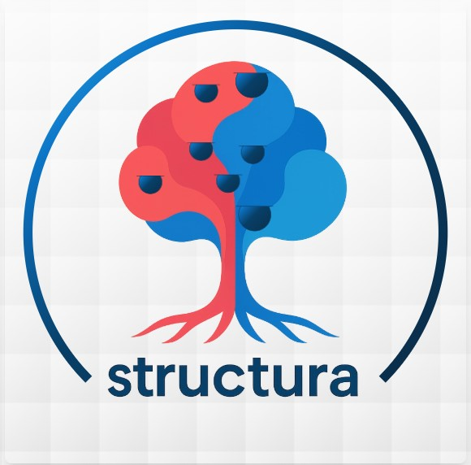
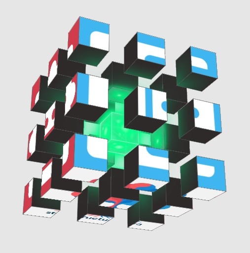
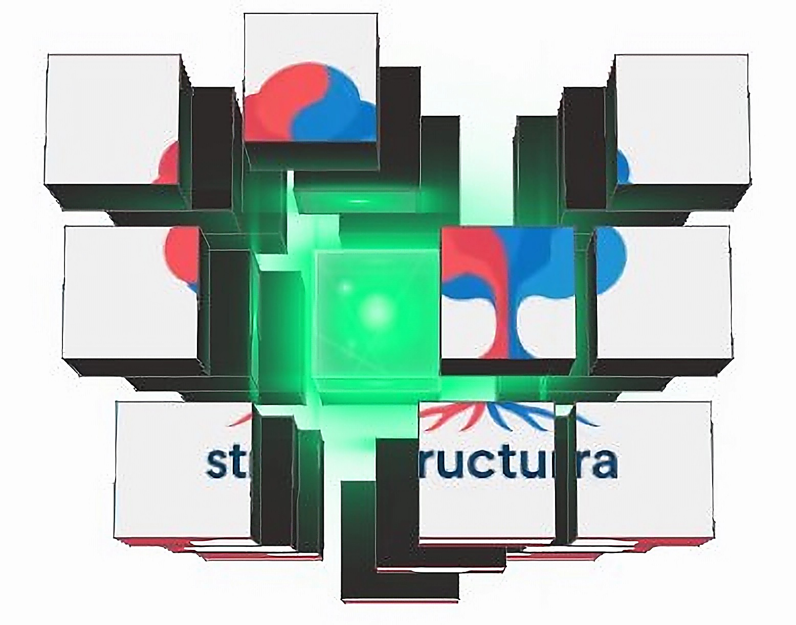

# MY STATIC PERSONAL WEBPAGE 
## structura-homepage

## Project description:
This website is designed for **my personal use**. 

'Structura' means 'structure' in Latin, and I believe structure is essential for growth. The talent of structuring is crucial to prevent an organization from stagnating. A good 'structure' is like the roots of a tree: they may not be visible, but they are vital.

'Heart' symbolizes 'health.' For an organization, 'cash' is like blood; it needs a strong system (accounts receivable) to receive and redistribute it (through investments) for the organization to thrive. 

'Tree' represents growth and productivity through its fruits. The right people, like branches, produce the right results."

'Cube' represents complexity and solution driven.

## Features:
'de fr en', on click reload the page with translations.

'linkedIn', 'X', 'Github', 'Slack' on click redirect on my page.

'contact me', on click send me a message: [formspree](https://formspree.io/)

## Color Theme
| Color Name | Hex Code | Preview |
|------------|----------|---------|
| Red  ++++  | `#D03C4B` |  |
| Red  +++   | `#E54656` |  |
| Red  ++    | `#F75759` |  |
| Red  +     | `#FC6B6D` |  |
| Blue +++++ | `#0A2F4D` |  |
| Blue ++++  | `#083F67` |  |
| Blue +++   | `#0C75C7` |  |
| Blue ++    | `#1786D2` |  |
| Blue +     | `#1E97D7` |  |
| Blue -     | `#2BA6E6` |  |
| Blue --    | `#3FB6F0` |  |
| Gray ++++  | `#B1B1B1` |  |
| Gray +++   | `#D9D9D9` |  |
| Gray ++    | `#F2F2F2` |  |
| Gray +     | `#F8F6F0` |  |
| White      | `#FFFFFF` |  |

for socialmedia icons:
- [fontawesome](https://fontawesome.com/icons/)
- [icons8](https://icons8.com/icons)

for companies' logo:
- [simple-icons](https://simpleicons.org/)

## Testing:

### Tests
- I tested the HTML code with [validator](https://validator.w3.org/#validate_by_input), all ok
- I tested the CSS code with [jigsaw](https://jigsaw.w3.org/css-validator/#validate_by_input), all ok
- I tested the Javascript, there are a few 'old version' code. 
- I tested different web browsers Chrome and Edge, all ok
- I tested different screen sizes, all ok (the site is responsive)

### The performances
- I tested my code with Lighthouse:

### SEO 
- Google Search Console, adding a 'sitemap.xml' a 'ld+json' in the head of the page
- for more see also [Google Marketing Platform](https://marketingplatform.google.com/) for google analytics and Tag manager

### Privacy / Terms / Cookies
I used [termly](https://termly.com/) for the Privacy Policy (Essential) - it should disclose:
* That contact form data goes to Formspree
* What happens to submitted information
* That you don't collect other personal data
* Basic visitor rights

Other possible documents to provide the user (especially if Google Marketing Platform is implemented):
- Terms of Service (Recommended) - Protects you from liability and sets usage rules
- Cookie Policy - Only if you add Google Analytics, Facebook Pixel, or other tracking later

### Technologies Used
- HTML5
- CSS3
- JAVASCRIPT

### Special library
- Tailwindcss

Sidenotes:
* because I have <<"build": "tailwindcss -i ./src/input.css -o ./public/output.css --minify">> inside 'package.json', I can only run the command:
* 'npm install' (if not already done),
* then 'npm run dev', 
* finally 'npm run build'. 
* For instance after modification of 'src/input.css'

## Credits:

### Code
- I found help on https://stackoverflow.com/
- I also used CodeInstitute examples 

### Content
- All content was written by myself 

### Media
- I was inspired by the fig tree from Paul Klee:

- Thanks to [squoosh](https://squoosh.app/) for helping with converting the format into WebP.

- Thanks to [bigjpg](https://bigjpg.com/) for helping with upscaling 'New logo 2', and to [vectorizer](https://vectorizer.io/) for vectorizing it and getting a svg.

- Thanks to [favicon.io](https://favicon.io/favicon-converter/) for helping with formating the favicon.

## Deployment:
1. Log in to GitHub and locat the [GitHub Repository](https://github.com/Cyril-CRGB/structura_homepage)
2. At the top of the Repository, locate the "Settings" Button on the menu.
3. At the left of the new window, find the "Page" Button under "Code and automation"
4. At the section "Branch" select "Main", then "Root" and clic "Save"
5. Wait until the link shows up, there you go !

## Gitpod:
1. Open new Workspace with this repository adresse.
2. Enter in the terminal: 'python3 -m http.server'
3. There you go !

## Find this web site:

[My personal website is live here](https://cyril-crgb.github.io/structura_homepage/index.html)

[My page on GitHub is here](https://github.com/Cyril-CRGB/structura_homepage)
