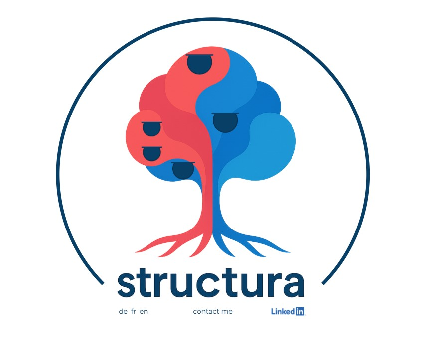

# MY STATIC PERSONAL WEBPAGE 
## structura-homepage

## Project description:
This website is designed for **my personal use**. 

'Structura' means 'structure' in Latin, and I believe structure is essential for growth. The talent of structuring is crucial to prevent an organization from stagnating. A good 'structure' is like the roots of a tree: they may not be visible, but they are vital.

'Heart' symbolizes 'health.' For an organization, 'cash' is like blood; it needs a strong system (accounts receivable) to receive and redistribute it (through investments) for the organization to thrive. 

'Tree' represents growth and productivity through its fruits. The right people, like branches, produce the right results."

## Features:
'fruits', on click gives away what i can do.

'de fr en', on click reload the page with translations.

'linkedIn', on click redirect on my linkedIn page.

'contact me', on click send me a message. https://formspree.io/

## Testing:

### Tests
- I tested the HTML code with https://validator.w3.org/#validate_by_input, all ok
- I tested the CSS code with https://jigsaw.w3.org/css-validator/#validate_by_input, all ok
- I tested the Javascript, there are a few 'old version' code. 
- I tested different web browsers Chrome and Edge, all ok
- I tested different screen sizes, all ok (the site is responsive)

### The performances
- I tested my code with Lighthouse:

### Technologies Used
- HTML5
- CSS3
- JAVASCRIPT

### Special library
- none

## Credits:

### Code
- I found help on <https://stackoverflow.com/>
- I also used CodeInstitute examples 

### Content
- All content was written by myself 

### Media
- I was inspired by the fig tree from Paul Klee, I used https://squoosh.app/ to convert the format into WebP.

## Deployment:
1. Log in to GitHub and locat the [GitHub Repository](https://github.com/Cyril-CRGB/structura_homepage)
2. At the top of the Repository, locate the "Settings" Button on the menu.
3. At the left of the new window, find the "Page" Button under "Code and automation"
4. At the section "Branch" select "Main", then "Root" and clic "Save"
5. Wait until the link shows up, there you go !

## Gitpod:
1. Open new Workspace with this repository adresse.
2. Enter in the terminal: 'python3 -m http.server'
3. There you go !

## Find this web site:

[My personal website is live here](https://cyril-crgb.github.io/structura_homepage/index.html)

[My page on GitHub is here](https://github.com/Cyril-CRGB/structura_homepage)
