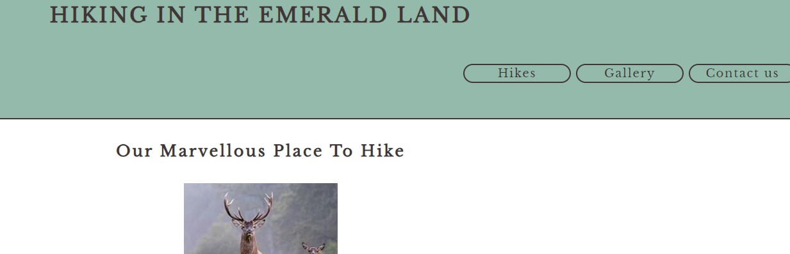
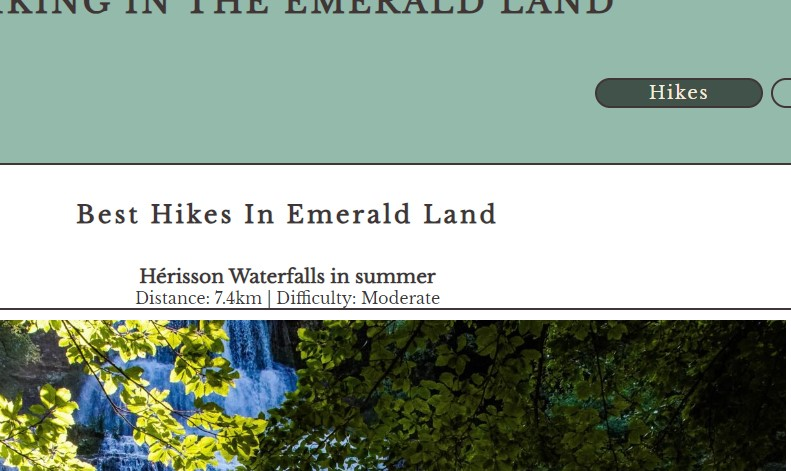
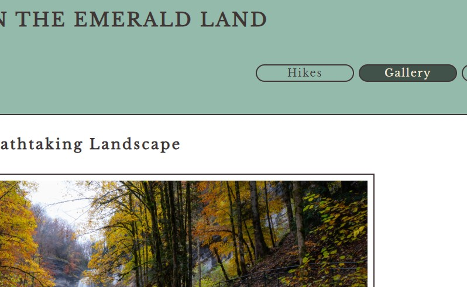

# Portfolio 1 - HTML/CSS Essentials 
## Hiking in the Emerald Land

## Project description:
This website is designed for **my personal use**. I do love hiking and I enjoy the place I live in.
I intend to use this site to publish my own journey. 
And help newbees like me find nice and enjoyable walking paths to follow.

## Features:
This website offers 4 different pages. The navigational link highlights when the visitor is on the active page.

An introduction page: 
A list of hikes: 
A gallery with pictures: 
And a contact page: 

## Testing:

### Tests
- I tested the HTML code with https://validator.w3.org/#validate_by_input, all ok 
- I tested the CSS code with https://jigsaw.w3.org/css-validator/#validate_by_input, all ok

- I tested different web browsers Chrome and Edge
- I tested different screen sizes
  
## The performances of my first project:

### Technologies Used
- HTML5
- CSS3

### Special library
- none

## Credits:

### Code
- I found help on <https://stackoverflow.com/>
- I also used CodeInstitute examples 

### Content
- All content was written by myself 

### Media
- Most of the pictures used are from https://www.terredemeraudetourisme.com/

## Deployment:
1. Log in to GitHub and locat the [GitHub Repository](https://github.com/Cyril-CRGB/Portfolio1)
2. At the top of the Repository, locate the "Settings" Button on the menu.
3. At the left of the new window, find the "Page" Button under "Code and automation"
4. At the section "Branch" select "Main", then "Root" and clic "Save"
5. Wait until the link shows up, there you go !

## Find this web site:

[My First Project is live here](https://cyril-crgb.github.io/Portfolio1/)

[My page on GitHub is here](https://github.com/Cyril-CRGB/Portfolio1)
