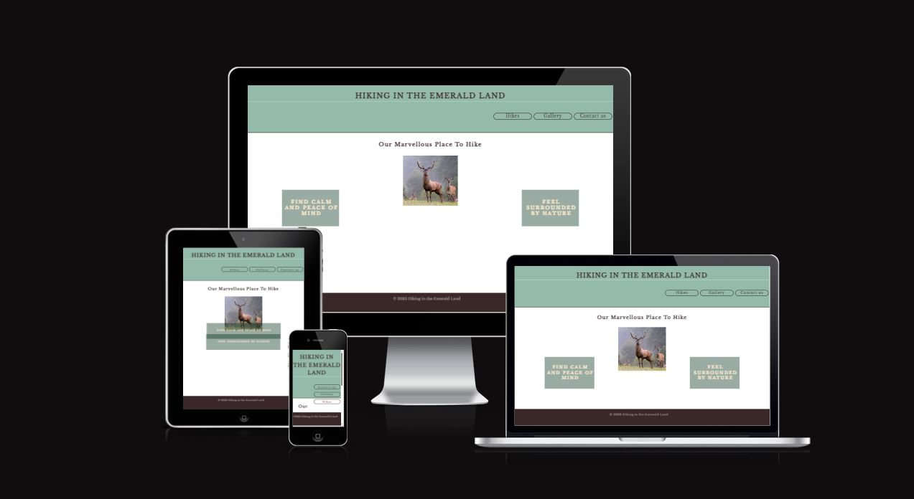
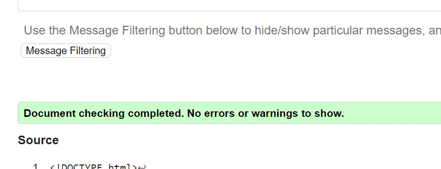
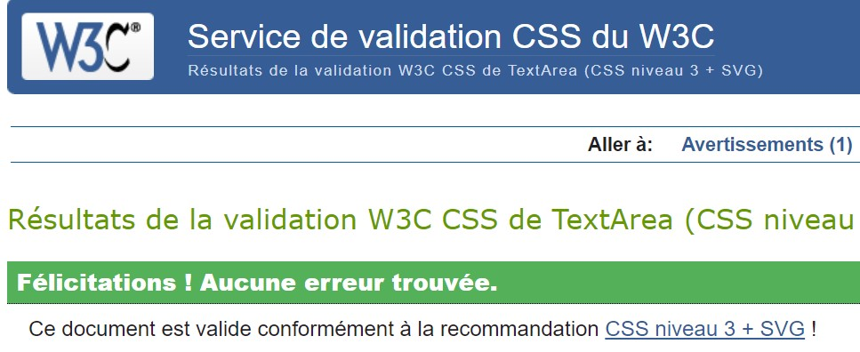

# STRUCTURA - STATIC PERSONAL WEBPAGE 
## Why 'STRUCTURA'

## Project description:
This website is designed for **my personal use**. 

## Features:
xxxx

## Testing:

### Tests
- I tested the HTML code with https://validator.w3.org/#validate_by_input, all ok 
- I tested the CSS code with https://jigsaw.w3.org/css-validator/#validate_by_input, all ok

- I tested different web browsers Chrome and Edge
- I tested different screen sizes
  
## The performances of my first project:

### Technologies Used
- HTML5
- CSS3
- JAVASCRIPT

### Special library
- none

## Credits:

### Code
- I found help on <https://stackoverflow.com/>
- I also used CodeInstitute examples 

### Content
- All content was written by myself 

### Media
- I was inspired by the figue tree from Paul Klee

## Deployment:
1. Log in to GitHub and locat the [GitHub Repository](https://github.com/Cyril-CRGB/Portfolio1)
2. At the top of the Repository, locate the "Settings" Button on the menu.
3. At the left of the new window, find the "Page" Button under "Code and automation"
4. At the section "Branch" select "Main", then "Root" and clic "Save"
5. Wait until the link shows up, there you go !

## Gitpod:
1. Open new Workspace with this repository adresse.
2. Enter in the terminal: 'python3 -m http.server'
3. There you go !

## Find this web site:

[My personal website is live here](https://cyril-crgb.github.io/structura_homepage/index.html)

[My page on GitHub is here](https://github.com/Cyril-CRGB/structura_homepage)
